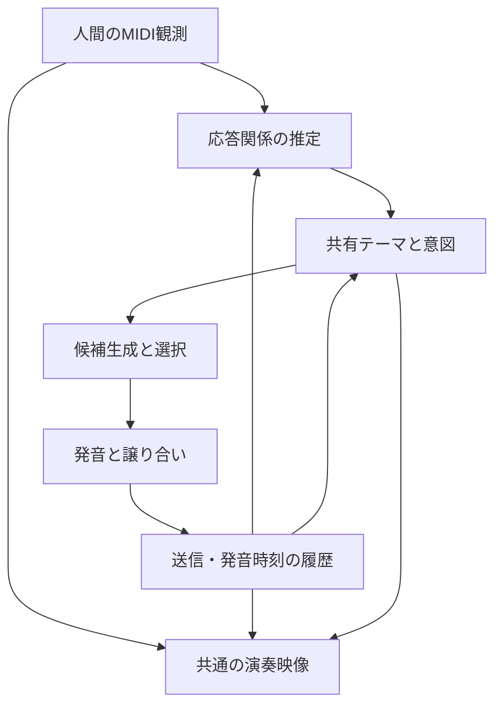

# Jev Bassist：相互に応答する合奏への統合修正計画

作成日：2026-09-21。基準：`m19-musical-lineage-field`、ローカルコミット `8415d20`。

状態：設計・実装計画。以下の追加機能は未実装。今回の文書作成ではアプリケーションコードを変更しない。

## 1. 完成させる体験

「ヨコタのA → JevのB → ヨコタがBを変形したB' → Jevがその変化を受け取ってCへ進む」という往復を成立させる。さらに、短い相づち、重奏、主導権の交代、新しい話題、沈黙、原型への回帰を同じセッションで扱う。

完成の中心は、ヨコタが「今の自分の返し方で、相手の次の演奏が変わった」と具体的な箇所を指摘できること。旋律の自然さ、音の安全な終了、映像の美観も独立に確認する。

| ヨコタの働きかけ | 目指すJevの振る舞い | 音・映像で確認できる結果 |
| --- | --- | --- |
| Jevが出した特徴的な音型をまねる | 取り上げられた音型を保って続きを作る | 共通の音型が二往復以上つながる |
| 同じリズムで音高を変える | リズムの応答として受け取り、新しい音高関係を使う | リズムの共通性が聞こえ、対応する軌跡が残る |
| Jevの途中に一音だけ返す | 状況に応じて続行し、語尾や次の応答に反映する | 返した瞬間に旋律全体が消えない |
| 別のフレーズを続けて提示する | 境界で主導権を渡し、新テーマ候補を育てる | 最初の原型へ機械的に引き戻されない |
| 長音・和音を置く | 持続・音域・和声の手がかりとして扱う | 無反応にも、和音の無理な単旋律化にもならない |
| 返答後に待つ | 文脈に応じて一度だけ続きを提案し、その後は待てる | 自律性と余白の両方がある |
| 展開後に原型を示す | 原型との関係を認識して回帰・収束する | 音と映像で同じ素材へ戻ったと分かる |

## 2. 監査結果と修正の対応

| ID | 確認した実装上の原因 | 主な根拠 | 修正段階 |
| --- | --- | --- | --- |
| A1 | 人間の最新入力をJevの直前の実演と比較していない。前応答の参照が最後の音高に偏る | `ConversationEngine.contextFor`、候補生成、`ConversationSelectionInput` | R2、R3、R6 |
| A2 | 人間の全Note Onで未送信応答を取り消す。離鍵・無音・API判断枠・拍待ちが積み重なる | `JamSession.handle/process`、`PhraseSegmenter`、`ConversationEngine.submit` | R1、R4、R6 |
| A3 | 展開元が最初の原型に偏り、共有テーマ・継続する意図がない | `developmentCandidates`、`prepareConversation`、`advance` | R3、R5 |
| A4 | 最初の発音確定で変形距離を一括加算し、回帰では一音でリセットする | `acknowledgeCommittedResponseNote`、`divergence` | R1、R5 |
| A5 | 単発音が素材にならず、和音由来の低い旋律確信度でジェスチャー全体が除外される | `MotifMemory.remember`、`PhraseSegmenter.finalize` | R2、R4 |
| A6 | 映像の変形元が実際の生成元と異なる。発音イベント配信が拍更新に依存する | `drawLineageForms`、`JamSession.sendDueEvents/tick` | R7 |
| A7 | オフライン評価が実行時計・スケジューラ・割り込み・発音履歴を再現しない | `LocalBassistSessionEvaluator.evaluate` | R0、R1、R8 |

前計画のP7〜P11を一括で実装済みとした記述は訂正する。役割付きの候補、実音列からの回帰距離、中心音の複数仮説、音付き動画、実機遅延、負荷測定には残作業がある。本計画の完了表で追跡する。

## 3. 設計上の決定

- 対象は `--style fugue --mode ...` の `rules` / `jev` 両方。現在のモード指定、フレーズ全体の音域配置、モード度数による変形を基礎にする。
- 人間の演奏観測は原本として保存する。モード補正は生成する音に適用する。
- Jevはローカル生成済み候補のIDを選ぶ。音列、発音時刻、割り込み時の安全判断はローカルが所有する。
- 同時に鳴るJevの声部は原則一つ。人間との重奏は許可する。複数の応答計画が重なって声部数が増えないよう、声部の占有時間を管理する。
- 指定BPMの共有時計を維持する。入力の相対タイミングや局所的な呼吸は保存し、演奏者のテンポへ追従する新しい時計は今回追加しない。
- 確信度は観測の強さを表す。模倣やリズムの共通性を推定するが、「賛成した」「嫌がった」などの心理状態を断定するラベルにはしない。
- 認識が曖昧なときは既存テーマを保ち、短い保守的な応答か待機を選ぶ。新テーマへの切替を一音だけで確定しない。
- ブラウザの音声入力は音量包絡・帯域・アタック・余韻の可視化に使う。MIDI送信から実際の可聴音を確認できたとは扱わない。
- CoreMIDIコールバックはコピーとキュー投入に限定する。Jev通信、記録、ブラウザ配信は発音処理を待たせない。
- 最終成果物は一つの統合版とする。内部は依存順の小さな変更・PRで検証し、ユーザーが段階ごとにブランチを切り替える運用にはしない。

## 4. 共通データと実行経路

同じ実行器に、ライブではCoreMIDI・実時計、評価では記録入力・仮想時計・仮想出力を接続する。評価専用の別の会話ロジックを作らない。

| データ | 主な内容 | 更新条件 |
| --- | --- | --- |
| `HumanGesture` | 演奏ID、元のnote ID、開始・終端候補、確定/暫定、音高集合、音価、音量、リズム、旋律確信度、ジェスチャー確信度 | 入力グループ、区間の更新・確定 |
| `ResponsePerformance` | response ID、note ID、計画音、送信済み音、発音予定時刻を通過した音、終了・短縮・キャンセル、出力失敗 | スケジューラの実行結果と時計 |
| `InteractionEvidence` | 比較対象ID、音対応、輪郭・音程・リズム・時間的近さ、競合する説明、確信度 | 新しい入力区間 |
| `SharedTheme` | 原型、現在の共有素材、直前の人間/機械の素材、採用根拠、保留中の新テーマ、版番号 | 根拠のある受け渡し・発音履歴 |
| `DialogueState` | 聴く/準備/応答/重奏/譲る/返事待ち/収束、現在の意図、期限、主導権、次の音楽的境界 | 入力・発音・時間のイベント |
| `ResponseCandidate` | 意図、実際の生成元、変形、音列、着地点、音同士の対応、適格性、評価 | 応答機会ごと |
| `ConversationTrace` | 観測、推定、選択根拠、候補、実行結果、API結果、各時刻、表示イベント | 全実行経路の記録 |

すべての参照は安定したIDと版番号を持つ。`sessionID` を追加し、再起動後の古いイベントを識別する。入力時のnote IDを、離鍵後の解析、応答の生成元、画面の軌跡まで引き継ぐ。

`origin` は最初に採用した原型として保存し続ける。`sharedTheme` は更新可能な別の値にする。変形元には原型、共有テーマ、最新の人間の素材、直前のJevの発音済み部分を明示的に指定できるようにする。

## 5. 実装段階

### R0：基準と評価器を先に整える

変更：`SessionEvaluation.swift`、`Tests/JevBassistCoreTests/SessionEvaluationTests.swift`、`Fixtures/`、`SPEC.md`、`README.md`。

1. 実装開始時のm19相当のソース・設定を固定する。コミットだけでなく、入力fixture、BPM、モード、音色、音量を比較条件として記録する。
2. 会話のシナリオを入力MIDI・時計進行・外部判断の完了・停止イベントの列として表せる `ConversationScenario` を追加する。
3. 現状版が失敗する事例を作る。特に「同じ終音だが別のJev旋律に返答する二つの履歴」と「演奏中の一音の相づち」を最初に固定する。
4. traceに、予定された音と送られた音を区別する欄を用意する。送信や音声を再現していない旧traceは不明として読み込む。
5. SPECの「再入場は常にキャンセル」「原型固定の候補選択」を新設計へ変更する箇所として明示する。READMEの現行説明と計画の説明を分ける。

完了条件：現状の不足を、感想だけでなく同じ入力・履歴から再現できる。旧入力fixtureはそのまま読み込める。

### R1：ライブと評価で同じ発音履歴を持つ

変更：新規 `ConversationRuntime.swift`、`ResponsePerformanceLedger.swift`、`SessionReplay.swift`。既存 `LocalBassist.swift`、`RollingMIDIScheduler.swift`、`SessionEvaluation.swift`、CLI `main.swift`。

1. `JamSession` に分散する入力・時計・スケジューラ・確定通知の順序を、純粋なCore側の実行器へ集約する。Apple固有の時刻変換と出力はアダプターに残す。
2. 実行器は入力・advanceを受け、送信すべきバッチを返す。実際の出力成功通知を受けて初めて送信確定にする。仮想出力も同じ成功/失敗通知を使う。
3. 音の状態を `planned → queued → committed → onsetElapsed → released` と、`canceled/failed` に分ける。`committed` はCoreMIDIへ渡した状態、`onsetElapsed` は発音予定時刻を通過した推定状態。実際に聴こえたという意味を与えない。
4. 履歴は「音の個数」ではなくnote IDで更新する。重複通知、同時刻の音、同じ音高の再打鍵、途中キャンセルに耐える。
5. 同じ時刻の処理順を固定する。既に送信した音の時刻経過、入力と外部判断の到着順、観測・方針更新、未送信計画の修正、Note Off優先の出力バッチ、成功通知、表示差分の順とする。入力の同時刻イベントは元の到着順を保存し、出力側のNote Off優先とは分ける。到着順もtraceへ保存し、過去の時刻を巻き戻さない。
6. 現行の `plan()` が全音を直ちに確認済みにするテスト用経路を、会話の統合テストから外す。ライブとリプレイを同じ実行器に通す。
7. intro bars、停止、出力エラー、遅着MIDIの処理もリプレイ可能にする。時刻と発音状態を読みながら進めるため、入力がない時間にも時計を進める。
8. traceのディスク書込み・JSON整形は上限付きの記録キューへ渡す。過負荷で記録を落とした場合は欠落を明記し、その区間を完全再現可能なtraceとして扱わない。記録のために発音を待たせない。

完了条件：同じシナリオのライブアダプターと仮想アダプターで、判断・送信音・キャンセル・発音履歴が一致する。取り消された未送信音や空の計画で会話の世代が進まない。

### R2：人間の働きかけと「Jevへの返答」を観測する

変更：新規 `ConversationObservation.swift`、`InteractionMatcher.swift`。既存 `PerformanceTracker.swift`、`PhraseSegmenter.swift`、`MotifMemory.swift`、`LocalBassist.swift`。

1. `PerformanceTrackerUpdate` に発音開始時の安定したnote IDを追加する。継続中の音は暫定長さとし、離鍵で確定する。既存イニシャライザーには既定値を設ける。
2. 観測を二段階に分ける。短いアタック群・持続・和音を表すジェスチャーと、原型候補になる確定フレーズを別々に出す。単音を受け取るために原型採用基準だけを緩める変更はしない。
3. 和音の存在・音域・強弱を伝える確信度と、そこから旋律を抽出できた確信度を分離する。旋律が不明でも、リズムや和声の手がかりは失わない。
4. 離鍵後の無音に加え、アタック間隔、長音、休符、音域・リズムのまとまりから暫定的な区切りを推定する。レガートや持続音がある場合も、境界の確信度付きで短い区間を提示する。
5. 連続演奏は上限付きの窓で処理し、意味のある境界で区切る。無音がないことだけを理由に保留音が増え続け、現行の64音上限で停止する経路をなくす。元の録音データは切り捨てない。
6. 直近のJev、人間自身の前フレーズ、共有テーマ、原型との関係を比較する。Jev側の比較対象は、人間が各音を弾いた時刻までに発音予定時刻を通過した部分に限る。
7. 音程列・輪郭・拍間隔・音価・アクセント・応答時間を比較する。長さの異なる断片、移調、一定倍率のテンポ変形を扱う、長さ上限付きの音対応付けを実装する。まず標準ライブラリの動的計画法で実装し、最大32音同士に制限する。
8. 出力は、模倣、続き、リズム応答、対照的な素材、新しい提案、曖昧という観測上の候補と根拠にする。単音や一般的な三音だけでは高い確信を与えず、競合候補との差も使う。

完了条件：Jevへの返答と人間自身の反復を区別できる。原型・人間の入力・終音が同じでも、直前のJevの旋律を変えると対応付けと後続判断が変わる。単音・和音にも観測イベントが出る。

### R3：共有テーマと継続する意図を持たせる

変更：新規 `ConversationMemory.swift`、`ConversationPolicy.swift`。既存 `ConversationEngine.swift`、`LocalBassist.swift`。

1. 原型のアーカイブと現在の共有テーマを分離する。最新入力を無条件でテーマにせず、前応答との対応、反復、時間的な近さから採用する。
2. 人間がJevの素材を拾った場合は、その入力に含まれる変化を現在の共有テーマへ反映する。直前のJevの全フレーズと人間側の対応部分を残す。
3. 新しい素材は保留候補に入れ、継続して提示された、または明瞭な新フレーズとして成立したときに境界で切り替える。一音の偶然一致や一度の不一致だけで切り替えない。
4. 意図を「受け取ったことを返す」「続ける」「問いかける」「支える」「収束する」「待つ」に分ける。意図を決め、その後に生成元・変形・着地点・密度を選ぶ。
5. 意図には有効期限と完了条件を持たせる。問いかけなら応答を待ち、関連する入力が来たら続きを作る。新しい情報がないまま毎tick意図を変更しない。
6. 新しい素材がないときは、未完の流れに限り短い続きを一度提案できるようにする。一回の沈黙につき自発提案は一回まで。その後は待ち、長い沈黙では密度と視覚の活動を減らす。
7. 状態遷移の理由をtraceに残す。説明には比較対象と観測値を使い、文章の後付けで理由を作らない。

完了条件：A→B→B'→CのCがB'の特徴を引き継ぐ。新しいテーマへ移っても最初の原型は参照可能。Jev自身の出力だけでテーマ採用や自発提案が永久に連鎖しない。

### R4：譲り合いと応答タイミングを修正する

変更：`ConversationPolicy.swift`、`ConversationRuntime.swift`、`RollingMIDIScheduler.swift`、CLI `main.swift`。

| 観測された状況 | 初期方針 | 未送信部分への処理 |
| --- | --- | --- |
| 短い相づち、対応する音型 | 重奏または現在の応答を続ける | 全キャンセルせず、次の語尾・密度を調整 |
| 継続的に新しい高密度フレーズが始まる | 人間へ主導権を渡す | 最も近い安全な区切りで後続部分を縮小・中止 |
| 長音・和音が置かれる | 支えるか、空間を空ける | 音域・緊張を検査した短い単声候補へ |
| 判定が曖昧 | 慎重に続ける/短く終える | 直ちに全消去せず、低密度化を優先 |
| 明示的な停止、出力エラー | 停止 | 現行のflushと消音、保留判断の破棄 |

1. `yieldToHuman()` の全Note Onからの直接呼出しを、状況を受け取るターン方針に置き換える。
2. `cancelAfter`、`replaceUncommittedSuffix`、`preserveCommittedReleases` に相当する操作を導入する。キャンセル単位をresponse全体だけでなくnote ID・区間にする。
3. 送信確定した音は取り消せたと扱わない。未送信のNote Offだけは安全な未来時刻へ短縮可能にし、対応する発音より前には移動しない。確定済みの解除を失わず、古い解除が同音高の新しい音を切らないよう再打鍵時刻も検査する。
4. 全出力計画を通してJev一声部を保証する。短い受け答えと長い返答の二重予約を防ぐ。
5. 応答開始は意図と演奏の隙間から先に決める。短い受け答えには半拍単位の開始機会を使い、フレーズ内の相対タイミングは維持する。毎回次の四分音符まで待たせない。
6. 350msを毎回足す開始時刻の決め方を廃止する。予約した開始時刻と送信余裕から判断期限を逆算する。締切までにJevが間に合わなければ、同じ開始時刻でローカル候補を実行する。
7. 即時に必要な譲り合い・短い応答はローカルで決める。文脈を含む長めの選択にはJevを使う。短い受け答えは一フレーズ内で連発せず、次の本返答と声部時間を共有する。

完了条件：相づちで未演奏の旋律全体が消えない。主導権交代は安全な境界で起きる。API遅延だけを変えても予約した開始時刻が後ろへずれない。

### R5：共有テーマから音楽的な続きを生成する

変更：`ConversationEngine.swift` から候補生成・評価を `ConversationResponseGenerator.swift`、`ConversationPhraseMetrics.swift` に分離。`ModalHarmony.swift` を調整。

1. 各候補に、意図、生成元、保全する特徴、局所的な着地点、変形、出典の音対応を付ける。
2. 模倣では取り上げられた特徴を明確に残す。発展ではその特徴の一要素を動かす。問いかけでは短く余白を残す。支えるときは音数・音域を抑え、収束では語尾・音価・密度に一貫性を持たせる。
3. 特定の度数を常に問い/終止へ割り当てず、モード、直前の人間の音、アクセント、方向、持続時間から着地点を候補化する。
4. 全候補を、生成元との輪郭・音程・リズムの対応、直前のJevのフレーズ全体との接続、拍位置の緊張と解決、跳躍後の動き、特徴的な跳躍の保全、同じ変形の反復で評価する。
5. 重奏候補は、人間の現在の音域・持続音・和音の確信度も使う。意図しない近接音や未解決の緊張を減らす。和声が曖昧なら低密度か待機を適格候補に残す。
6. 原型からの距離を、対応付けた実音列の輪郭・音程・リズム・省略率から求める。未発音の予定音は含めず、情報の少ない途中経過は距離と確信度を別々に持つ。
7. 同じechoを繰り返しただけで距離が増え続ける計算をやめる。現在の素材の実測距離と、直近の発音履歴を使って回帰機会を選ぶ。
8. 回帰完了は、原型の特徴音・リズム・末尾を含む必要区間の発音予定時刻通過と終了で判定する。一音のみ、途中中断、キャンセルを完了にしない。
9. 前計画の残作業を含める。広すぎる音域を音ごとに折り畳む候補は除外し、構造を保った断片か休止へ退避する。長い主題の選抜では冒頭と末尾の枠を先に確保する。
10. 中心音は上位候補と確信度を保持する。直近の人間の素材で更新し、複数区間で十分な差が出たときだけテーマ境界で切り替える。すでに送信した音を変更しない。原型への厳密な回帰には原型の中心音情報を使い、現在の演奏と衝突する場合は延期する。

完了条件：変形名だけで評価・回帰が決まらない。前応答の中間部分を変える反実仮想テストで、接続評価と適切な候補が変化する。既存の音域・モード・単声の改善が維持される。

### R6：Jevへ会話の状態を渡す

変更：`ConversationSelectionInput`、`JevConversationDecisionProvider.swift`、対応するCore/Jevテスト。

1. 入力へ、原型・共有テーマ・直前の人間・直前のJevの実行済み部分、音対応の根拠、主導権、意図、返答待ちの状態を追加する。
2. 各候補に、どの素材の何を引き継いだか、どの意図を実現するか、次にどの余白を残すかを含める。IDだけで素材の履歴を表現しない。
3. 出力契約は候補IDの選択を維持する。既存の接続先とchoice形式を使い、新しい外部APIの存在を前提にしない。
4. ローカルで不適格な候補を除外してから送る。期限内でも、theme版・turn版・候補集合が古ければ採用しない。小さな相づちで自動的に全リクエストを失効させず、前提が崩れた場合に失効させる。
5. 応答機会に期限を付け、未確定の計画だけを変更可能にする。発音後に遅れて届いたJevの選択で音列を差し替えない。
6. traceに `rules/jev/fallback`、不採用理由、API所要時間、残り時間、選択された意図と素材を記録する。秘密情報を記録しない。
7. リクエストは意味のあるフレーズ・意図の境界で行い、単音ごとに送らない。上限付きの要約と一件の実行中リクエストで負荷を管理する。
8. 要約がサイズ予算を超える場合は古い履歴、重複する候補説明の順に圧縮する。現在の応答関係・候補ID・適格性は保ち、必要情報まで削る必要がある場合はローカルへ退避して理由を記録する。

完了条件：同じ候補集合・発音開始機会をrules/jevが共有する。API遅延・無効ID・低確信・古い完了を注入しても、適格性と発音時刻を守れる。

### R7：音と同じ履歴を使う映像へ接続する

変更：新規Core側 `ConversationVisualEvent.swift`、CLI `JamWebServer.swift`、`main.swift`、`Resources/index.html`。表示状態と描画を `Resources/session-timeline.js`、`Resources/lineage-field.js` に分離する。

1. 表示イベントに `sessionID/eventID/noteID/gestureID/responseID`、実際の生成元、対応音ID、発音予定時刻、確定/取消/終了を含める。現在の人間素材を一律に変形元として結び付けない。
2. 人間が弾いた軌跡を、そのIDのまま記憶・共有テーマ・Jevへの受け渡しに使う。音同士の対応は生成時の写像を使い、配列の同じ添字を無条件に結ばない。
3. 曲線の座標系はフレーズ単位で保持する。開示済みの先頭部分だけで毎回横幅を再計算し、既存点が跳ぶ処理をなくす。ライブ入力の延長が必要なら連続的に視野を移す。
4. 単音の派手な図形を主役にせず、同じ軌跡の受け渡し、並走、分岐、静止、再整列で関係を見せる。原型回帰は保存済みの形へ実際に近づく変形にする。
5. 聴いている間は人間の軌跡を受け入れる空間、返事待ちは保持と静止、重奏は対応する線の並走、譲るときは後退と余白で示す。観測の確信が低い場面に強い『理解した』演出を付けない。
6. MIDI送信バッチの確定後、表示差分を非同期で即時配信する。拍の状態通知と演奏イベントを分離する。配信の小さなまとめ送りを使う場合も上限16msとし、拍待ちを導入しない。
7. Swiftの単調増加するセッション時計とブラウザの `performance.now()` を同期する。往復時刻からオフセットと不確かさを見積もり、壁時計の変更で時間を飛ばさない。ブラウザがMIDI時計の主導権を持たない構造を維持する。
8. 遅着イベントは元の経過時間へ追い付ける。古いアタックを受信時刻から再点灯しない。再接続・タブ復帰は状態スナップショットとウォーターマークで復元する。
9. 同じ音高の複数発音をnote IDで管理する。片方のNote Offで別の音や線を消さない。古いresponseの取消が新しいresponseを消さないよう版を検査する。
10. SSEの遅いクライアントは上限付きキューと最新スナップショットで扱う。表示が詰まってもMIDIを止めない。JSの配信パスは固定の許可リストと適切なMIME型で追加する。
11. 実音解析の平滑化を経過時間ベースにし、入力デバイスの開始・停止・切替を検証する。モード表示、二つの音量、音声入力、状態は小さな操作パネルへ置き、タッチとキーボードでも開閉できるようにする。
12. 線の数・解像度に上限と負荷低減を設ける。動きを減らす設定、無音、非表示タブを扱う。固定シナリオから音付きの短い比較動画を作る。

完了条件：映像が示す出典と生成元が一致する。音ごとの位相が拍待ちで遅れず、再接続で古い音が再発光しない。映像から会話の受け渡しを説明でき、通常画面に状態説明の文字を増やさない。

### R8：統合検証とリリース判定

変更：Core/Jev/MIDIのテスト、ブラウザ時系列テスト、`Fixtures/`、`.github/workflows/ci.yml`、`README.md`、`SPEC.md`、新規 `CONVERSATION_VALIDATION.md`。

1. R0のシナリオを新しい共通実行器で回す。入力だけでなく、判断・キャンセル・発音履歴・表示差分を保存する。
2. 自動評価形式をv3へ進め、v1/v2は継続して読む。旧データにない履歴や対応関係を推測で埋めない。生MIDI fixture v1は互換のまま使う。
3. CIで `swift build`、`swift test`、既存ASan、JSの時系列検証を実行する。ブラウザの実描画も音付き比較動画とフレーム計測で確認する。
4. 発音時刻、記憶更新、旧スタイル、既存CLI、音量操作、停止処理の退行を確認する。GUIテストは見た目のスクリーンショットだけで終了しない。
5. rulesとJevの違いを同一入力・同一候補で比較する。録音固定の比較は処理と選択の比較であり、人間が返し方を変える相互作用の評価とは分ける。
6. JD-Xi/UR22mkIIの実機で、以下の短い往復セッションと30分の継続動作を確認する。実機未確認ならその状態を明示し、体験の完成を宣言しない。
7. READMEの利用手順は統合版の一つの起動例に更新し、現在のコードに存在するオプションだけを書く。実装開始時に基準を揃えた統合ブランチへ各変更を取り込み、最終差分と検証結果をまとめる。

## 6. 初期パラメータと制約

以下は実装時の初期値・予算であり、達成済みの測定値ではない。意味を持つ設定はバージョン付きtraceに保存し、調整前後を比較できるようにする。

| 項目 | 初期値・方針 | 理由 |
| --- | --- | --- |
| 同時アタックのグループ化 | 現行40msを基準 | 和音の展開と旋律の区別を維持する |
| 応答関係の比較長 | 各素材最大32音、直近各8区間 | 計算時間と履歴を上限付きにする |
| 原型/テーマ | セッション原型1、活動中テーマ1、直近アーカイブ最大4 | 原型保存と話題の更新を両立する |
| 自発的な追加提案 | 一つの沈黙につき最大1回、待機2〜4拍を初期範囲 | 止まる能力を失わない |
| 短い受け答え | 原則1〜2音、少なくとも2拍の間隔 | 全Note Onへの過剰反応を避ける |
| 送信確定の先読み | 現行50msを基準、変更時は別途計測 | キャンセル可能範囲を明確にする |
| 発音開始の最小余裕 | 先読み50ms＋安全分。初期80ms | 実行キュー・出力の余裕を確保する |
| Jevの判断期限 | 予約した発音開始から送信余裕を引く。API待ち上限350ms | 待ち時間を音楽へ加算しない |
| 外部判断の頻度 | 意味のある境界のみ、最大2件/秒、同時1件 | 単音ごとのリクエストと連鎖を防ぐ |
| 候補数/要求サイズ | 最大12候補、要求JSON内部予算16KiB | 入力の欠落と過大化を管理する |
| テーマ切替 | 複数の独立した手がかりと競合候補との差を要求 | 偶然の一致・不一致で話題を飛ばさない |
| 音声・映像履歴 | 時間と件数の両方に上限。曲線群最大8 | 長時間で表示負荷を増やさない |

旋律認識の閾値はR0/R2の正例・負例で決める。開発fixtureとは別の評価fixtureを残し、全例を通すためだけの個別分岐は追加しない。

## 7. 必須の受け入れシナリオ

| ID | 入力・操作 | 確認する条件 |
| --- | --- | --- |
| T01 | 終音だけ同じ二つのJev旋律に、片方を模倣する同じ人間入力を与える | 対応付け・意図・後続候補が履歴に応じて変わる |
| T02 | Jevが別の音型を出した後、人間が自分の前フレーズを反復する | Jevへの模倣だと高確信で誤認しない |
| T03 | Jevを移調して返す/リズムを伸ばして返す | 共有される特徴を認識し、次の音にも残す |
| T04 | Jevの途中に一音の相づちを入れる | 未送信の全音を取り消さず、新テーマも確定しない |
| T05 | 新しい高密度フレーズを継続する | 安全な境界で譲り、テーマ候補の採用理由を記録する |
| T06 | 全アタックが和音/長音一つ/短い一音 | ジェスチャーとして受け取り、旋律を捏造しない |
| T07 | 256音以上を無音なしで演奏する | 区間が更新され、保留領域の増加で停止しない |
| T08 | 返答の途中で人間が入り、一部をキャンセルする | 実行済み部分のみが履歴となり、IDと解除を維持する |
| T09 | 回帰の一音目・中間で中断する | 回帰完了と距離ゼロを誤って記録しない |
| T10 | 同じechoを繰り返す | 変形名の回数だけで原型からの距離が増えない |
| T11 | 人間が応答後に長く沈黙する | 一度の短い提案後は待てる。出力だけで会話が自己増殖しない |
| T12 | API完了0/100/350/1000ms、無効ID、低確信、旧版の完了 | 発音機会を動かさず、期限内の適格候補かローカルへ解決する |
| T13 | 同音高の再打鍵・同時刻の解除と発音・出力失敗 | Note Offの取り違え、鳴りっぱなし、架空の発音履歴がない |
| T14 | 原型/最新人間/直前Jevをそれぞれ変形元に選ぶ | 表示する元の軌跡と音同士の対応が一致する |
| T15 | 拍途中の発音、SSE遅延、切断再接続、タブ復帰、壁時計変更 | 音を受信時刻から再演出せず、共通時系列へ復帰する |
| T16 | 広い音域、8音超の特徴音が多いフレーズ、曖昧な中心音 | 不要な輪郭反転と末尾欠落がなく、確信がない中心音変更を保留する |
| T17 | 同一シナリオを二度再生、ライブ相当と評価器で再生 | 非決定的な実測値を除き、判断・MIDI・履歴・表示イベントが一致する |
| T18 | intro bars、旧スタイル、二つの音量、停止、30分セッション | 既存契約を守り、未処理イベント・図形・履歴が無制限に増えない |

T01〜T03では「内部ラベルが変わった」だけを合格にしない。生成音に対応する特徴が残り、候補とその採用理由まで差が出ることを確認する。

## 8. 時間・負荷・体験の測り方

traceに入力受信、観測成立、候補生成、API開始/完了、選択期限、予約発音、送信確定、発音予定時刻通過、ブラウザ受信/描画の時刻を分けて保存する。

| 指標 | 初期の目標/確認方法 |
| --- | --- |
| ローカル解析・候補生成時間 | 対象Macでp95 2ms、p99 4msを初期予算とし、超過時は比較窓・候補数を調整する |
| 発音送信 | 同じ音の予定時刻に対して先行して渡せること。意図した音楽的な間と処理の遅れを別集計する |
| 短い受け答えの開始 | 観測成立から概ね0.25〜1拍を初期目安とする。毎回の強制発音にはしない |
| API依存の発音遅延 | シミュレーション上0。タイムアウトでも予約したローカル発音を維持する |
| 表示差分の配信待ち | 発音バッチ確定後、アプリ内p95 16ms以下を初期目標とする |
| 映像と発音予定時刻の差 | 前景タブでp95 50ms以内を初期目標。時計推定の不確かさも併記する |
| 描画 | 通常60fpsを目標。フレーム時間のp50/p95/p99と過負荷時の低減動作を記録する |
| 実際の可聴音と映像の差 | JD-Xiの出力を録音して別途確認する。MIDI時刻だけから実測済みとしない |
| 長時間 | 30分で履歴・表示キュー・保留判断が上限を守り、解除漏れ・停止・遅延増大がない |

固定入力の比較では、現状m19、修正rules、修正jevを同じ音色・音量で再生する。音楽性と関係認識を別々に記録する。

実際の往復は、模倣、リズム応答、一音の相づち、新テーマ、沈黙を含む約3分のセッションで比較する。条件の順序を入れ替えて再確認し、次の5項目を各1〜5で記録する。

1. 自分のどの素材が返ってきたか分かる。
2. 相手への返し方によって、その次の演奏が変わる。
3. 重なって弾いても相手の流れを不自然に壊さない。
4. 相手から提案があり、こちらが止める・導く余地もある。
5. 映像が同じやり取りを示し、音から注意を奪わない。

体験の受け入れには、少なくとも二つの往復でヨコタが「自分のこの変更を相手が拾った」と具体的に指摘できることを求める。点数だけで合格にせず、対応するtraceと音を確認する。これは小規模な製品評価であり、統計的な有効性の証明とはしない。

## 9. 実装順序、互換性、成果物

実装順序は **R0 → R1 → R2 → R3 → R4 → R5 → R6 → R7 → R8**。R1の発音履歴が認識と映像の基盤になるため、この順序を守る。全体を通すまで統合版の完成を宣言しない。

一連の実装を同じ統合ブランチで管理し、各段階を小さなPRとして取り込む。実装開始時にm19のGitHub上の状態を確認し、ローカルとリモートの基準を揃える。既存の変更を強制上書きしない。

| 成果物 | 内容 |
| --- | --- |
| アプリケーション | 新しい観測・共有テーマ・意図・譲り合い・履歴・映像を接続した統合版 |
| シナリオfixture | T01〜T18の再現入力、仮想時間、外部判断、期待される振る舞い |
| 評価trace v3 | 計画・送信・時刻通過・取消・関係推定・選択理由・映像参照を区別したデータ |
| 比較素材 | 同条件の音声、20〜30秒の音付き映像、rules/jevの選択比較 |
| 検証記録 | macOS CI、性能分位点、実機条件、残課題、体験評価 |
| 利用文書 | 実装と一致したSPEC/README、統合版の起動手順 |

既存の生MIDI fixtureとCLIを維持し、Codableの追加項目は旧データを読めるようにする。未知の履歴を既知の発音に変換しない。bass/ambient/memoryスタイルは共通部分の回帰対象とし、会話の仕様変更はfugue経路へ適用する。

既存の公開イニシャライザーには既定値・移行用オーバーロードを設ける。Swift 6の並行性を守り、可変状態は所有キューを明示する。新しいランタイム依存を前提にせず、標準ライブラリと既存Appleフレームワークで実装する。

## 10. 完了状況の管理

| 段階 | コードと自動検証 | 実機・体験検証 |
| --- | --- | --- |
| R0 基準・評価 | 未着手 | 比較条件を実装時に固定 |
| R1 共通実行・履歴 | 未着手 | MIDI送信・停止を確認予定 |
| R2 観測・応答関係 | 未着手 | 短い返答・和音・レガートを確認予定 |
| R3 共有テーマ・意図 | 未着手 | 二往復以上の接続を確認予定 |
| R4 譲り合い・時間 | 未着手 | 相づち・重奏・主導権交代を確認予定 |
| R5 音楽生成・回帰 | 未着手 | 比較試聴を実施予定 |
| R6 Jev接続 | 未着手 | 採用率・遅延と選択の質を確認予定 |
| R7 映像 | 未着手 | 音付き動画・同期・操作を確認予定 |
| R8 統合 | 未着手 | 実セッションと30分確認を実施予定 |

各行の完了には対応する差分、テスト結果、実機確認の有無を添える。音程や図形だけの改善で、相互応答の完成としない。
